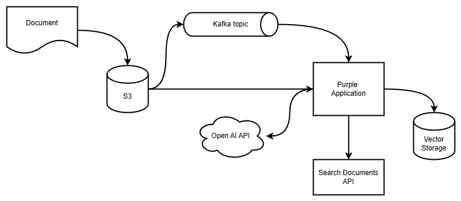

# okey-dockey

The system allows to store documents in S3-compatible storage and generates vectorized copy which allows to find documents by semantics not by concrete content.

## Overview
When a document is uploaded to a designated S3 bucket, an event is emitted to a Kafka topic. The application listens to this topic, extracts the document path from the event payload, retrieves the document, generates its vector representation, and stores it in a vector database. This enables semantic search, allowing documents to be found based on meaning rather than exact content.



## S3
Minio with kafka notification enabled. `dockey-bucket` is set up to emit events about new documents.

## Open AI API
`llama.cpp` implementation with popular `ggml-org/gemma-3-1b-it-GGUF` model is used for embeddings. This model generates vectors with length of 1152. This number should be used in database migrations.

## Purple Application 
Is described in nested project

## Vector Storage
PostgreSQL with pgVector extension enabled. There are two scripts `create-extension.sql` and `create-table.sql` in the `vector-storage` directory to setup database. Be careful with vector length you create a table.

## How to run
First build `purple-app` by 
```sh
docker compose build
```
Run the system
```sh
docker compose up -d
```
At the first run, the model will be downloaded by llama.cpp.  
Wait for all containers are up and ready.

#### Workflow
- Go to minio interface `http://localhost:9001` use **user/password** to log in. Open `dockey-bucket` and upload `.txt` file there. It would be better if you upload few files and each file contains several sentences.

- Request documents using REST API enpoint exposed by `purple-app`. Put your query as URL query parameter `q` and set desired number of results. For example: `http://localhost:8095/api/v1/documents?q=hello%20world&n=2`. You should see list of results as response.


## TODO
- [ ] Use liquibase for migration