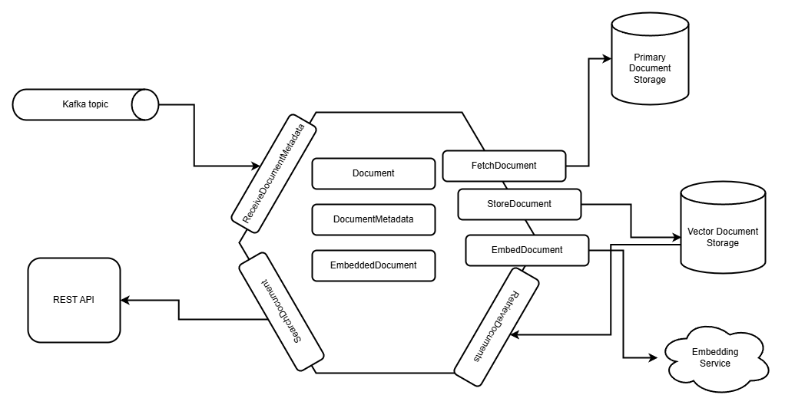

# The Purple Application

Purple is an application that transforms documents into vector representations, enabling fast and accurate semantic search.

## Overview

The application receives events when a new text document is uploaded to S3, then fetches the document, generates embeddings, 
and saves them to a vector database. 

Application is designed as Hexagonal architecture - also known as the Ports and Adapters pattern - is a software design 
approach that organizes an application so that its core business logic is independent of external systems like databases, 
user interfaces, or APIs.

## Embedding Service
Open AI API is used as interface to embeddings service. To use concrete service environment var `OPEN_AI_URL_ENDPOINT` should be set.
Vectors have a fixed size determined by the model, so the vector storage must be configured to match the model's specifications. 
If the model is updated or replaced, all document vectors must be regenerated to ensure compatibility.

## Vector Storage
As vector storage PostgreSQL with pgVector extension is used. This implementation provides typical for relational databases
interface and well-known SQL query language. pgVector stores fixed-sized vector and correct vector size should be set on table 
creation. Database connection is managed by `HikariCP`

## REST API
Only one endpoint is provided which allows to search document by semantics, a list of document contents is returned as response
Desired number of results can be defined as query parameter  
`GET /api/v1/documents?q=hello%20world&n=3`

## Configuration
| env variable              | description                   |
|---------------------------|-------------------------------|
| `VEC_DATABASE_DRIVER`     | database driver               |
| `VEC_DATABASE_URL`        | jdbc conn string              |
| `VEC_DATABASE_USERNAME`   | db username                   |
| `VEC_DATABASE_PASSWORD`   | db password                   |
| `KAFKA_BOOTSTRAP_SERVERS` | kafka bootstrap servers (csv) |
| `KAFKA_GROUP_ID`          | kafka group id                |
| `KAFKA_TOPIC`             | kafka topic                   |
| `AWS_URL_ENDPOINT`        | AWS base url to connect to S3 |
| `AWS_BUCKET_NAME`         | AWS S3 bucket name            |
| `AWS_REGION`              | AWS region                    |
| `AWS_ACCESS_KEY_ID`       | AWS access key id             |
| `AWS_SECRET_ACCESS_KEY`   | AWS secret access key         |
| `OPEN_AI_URL_ENDPOINT`    | Open AI API base url          |
| `API_PORT`                | port for rest api             |

Application can be started locally if required infrastructure is provided. For this case default `local` configuration can be used.

## Limitations
Purple application is not supposed to be running for production purposes.  

**Missing Document Splitter**. In production systems document splitting should be used to split document to smaller parts
by paragraphs or semantically. There is special interface `SplitDocument` defined in the application, so actually document splitter is supported,
but not implemented yet. Simple wrapper called `placeholder` is used so far.

**Only plain text files are supported**. Only txt files are supported so far. It is enough to demonstrate core functionality.

**Missing ORM**. I have not explored Kotlin Exposed ORM for vector field support. So raw queries is used so far.

## TODO:

- [ ] Add filenames to search documents result
- [ ] Explore Kotlin Exposed ORM for vector type support
- [ ] Add document splitter
- [ ] Add more supported documents format
- [ ] Add index to vector storage
